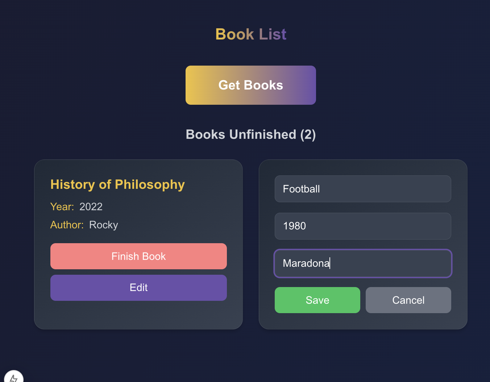

# Library DApp

A Web3 application for managing a personal library on the blockchain. Built with Next.js, Solidity, and Ethereum.

## Features

- Connect with MetaMask wallet
- Add new books with details:
  - Title
  - Author
  - Year
  - Reading Status
- Edit book details
- Mark books as read
- View lists of unfinished and finished books
- Responsive and modern design

## Tech Stack

- **Frontend:**

  - Next.js
  - TypeScript
  - Tailwind CSS
  - ethers.js v6

- **Smart Contract:**
  - Solidity ^0.8.0
  - Hardhat
  - Chai (for testing)

## Smart Contract

The Library.sol smart contract provides the following functions:

- `addBook`: Adds a new book
- `getFinishedBooks`: Retrieves the list of finished books
- `getUnfinishedBooks`: Retrieves the list of unfinished books
- `setFinished`: Marks a book as finished
- `editBook`: Edits book details

## App UI

